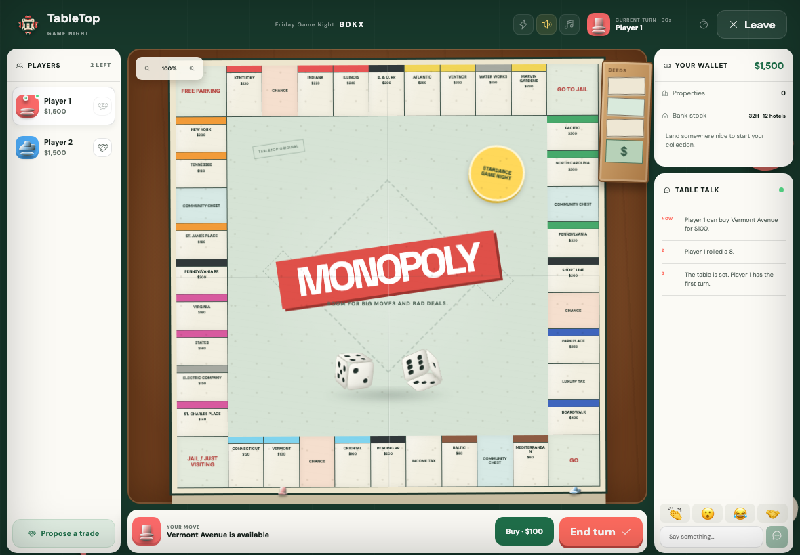

# TableTop

**A cozy online Monopoly table that feels like game night with friends, without accounts, bots, or a game server.**



### [Play TableTop live](https://tabletop-monopoly-night.vercel.app)

Open the link, create an online room, and share its four-character code. You can also make the room public so other players can find it from **Public tables**.

## Features

- Play complete Monopoly games with 2–8 players online or through local pass-and-play
- Discover public tables, join private rooms by code, or spectate games in progress
- Buy and auction properties, collect rent, trade, mortgage, build, go to jail, and play to bankruptcy
- Roll animated 3D dice on a physical-style board with tokens, deeds, houses, and hotels
- Chat, send reactions, inspect the event log, and manage your property portfolio

## Run locally

Requires Node.js 20 or newer.

```bash
npm install
npm run dev
```

## How it works

TableTop has no application backend. Trystero uses MQTT signaling to connect browsers, then game state, chat, room rosters, and public-table announcements travel directly between players over WebRTC. Hosts remain authoritative for room membership and continuously acknowledge roster state so a missed peer event cannot leave someone stuck outside the table.

The game itself is built in React with native CSS. Monopoly rules and synchronized state live entirely in the browser.

I hate backends btw

## Credits

- **Game logic and direction:** [Hamdan Nishad](https://github.com/Hamdan772)
- **UI and visual assets:** AI did it (OpenAI Codex)
- Built for the Hack Club Stardance event
