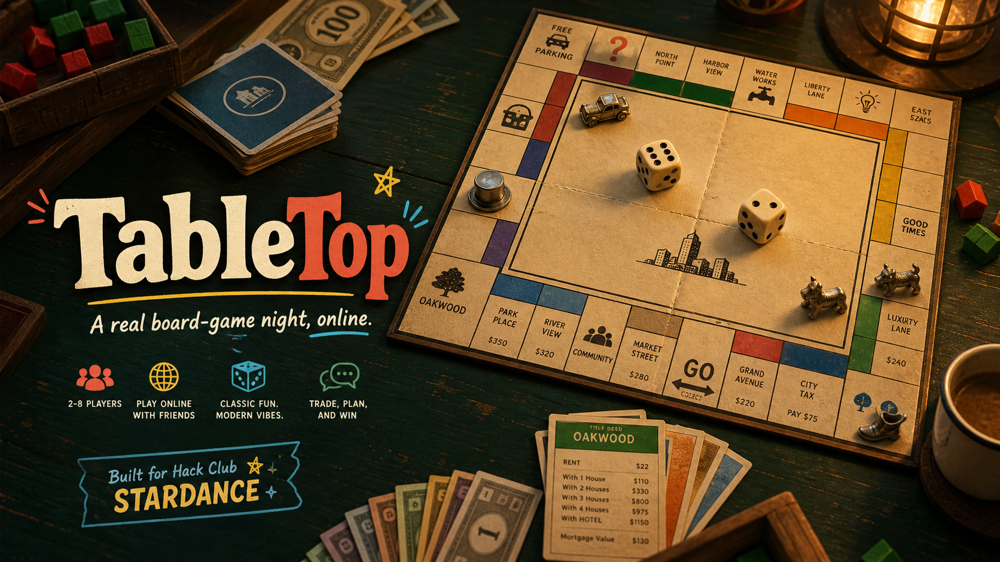

<p align="center">
  
</p>

<h1 align="center">TableTop</h1>

<p align="center">
  <strong>A real board-game night, online.</strong><br>
  Roll dice, make questionable deals, and bankrupt your friends without cleaning up afterward.
</p>

<p align="center">
  <a href="https://tabletop-monopoly-night.vercel.app"><strong>Play TableTop</strong></a>
  ·
  <a href="#how-online-play-works">How online play works</a>
  ·
  <a href="#run-it-locally">Run locally</a>
</p>

## Made for Stardance

TableTop was created for the **Hack Club Stardance** event. The challenge was to make online Monopoly feel less like another browser game and more like everyone pulled up a chair around the same cozy table.

The result is a fully playable, backendless game night with physical-feeling dice, colorful tokens, a detailed board, property management, trading, and peer-to-peer rooms.

## Tonight's Game

### Monopoly

- Play with **2–8 people** online or through local pass-and-play
- Roll animated 3D dice directly on the board
- Buy properties, collect rent, pass GO, and build houses or hotels
- Draw Chance and Community Chest cards
- Trade cash and properties with the table
- Mortgage, unmortgage, survive jail, declare bankruptcy, and win
- Follow every dramatic decision in the live table log

## How Online Play Works

1. One player creates a room and shares its four-character code.
2. Friends enter the code and choose their names and tokens.
3. The host starts the game when everyone reaches the table.
4. Game state travels directly between players over encrypted WebRTC.

TableTop has **no application backend, database, accounts, bots, or saved player data**. Trystero uses public MQTT signaling only to help browsers discover each other; gameplay itself is peer-to-peer.

## The Tabletop Feeling

TableTop is built around the small details that make a board-game night feel real:

- A warm wooden table and layered paper board
- Physical metal-style player tokens
- Tactile dice with shadows and rolling motion
- Property deeds, paper money, board folds, and gentle surface wear
- A coffee cup, pencil, snack bowl, and the occasional terrible deal
- A social, colorful interface designed for game night rather than a casino

## Run It Locally

```bash
npm install
npm run dev
```

Open the local URL printed by Vite. To test online play from one computer, create a room in one browser and join it from another.

## Build And Deploy

```bash
npm run build
npm run preview
```

TableTop is a static Vite app and needs no environment variables. Deploy it with:

```bash
vercel --prod
```

## Built With

- React 19
- Vite
- Trystero MQTT signaling + WebRTC peer-to-peer data
- Phosphor Icons
- Native CSS

## Credits

**Game logic and project direction:** [Hamdan Nishad](https://github.com/Hamdan772)

**UI design and visual assets:** Created with AI assistance from OpenAI Codex and image-generation tools under Hamdan's direction, including the TableTop interface, logo, and README banner.

Built for **Hack Club Stardance**.
