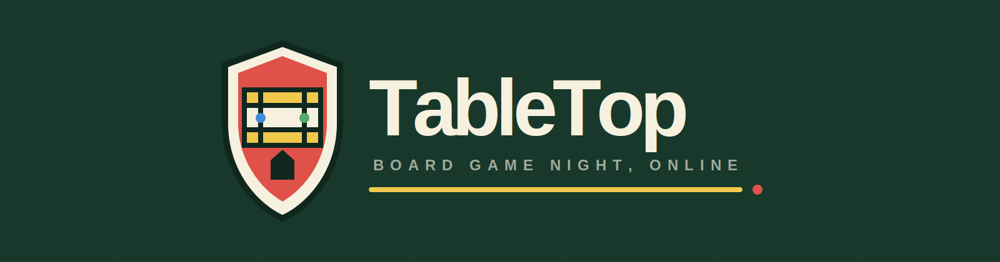

<p align="center">
  
</p>

<p align="center">
  <strong>A cozy digital table for classic games.</strong><br>
  Built for <strong>Hack Club Stardance</strong>.
</p>

<p align="center">
  <a href="https://tabletop-monopoly-night.vercel.app"><strong>Play TableTop</strong></a>
</p>

## Games

- **Monopoly:** complete 2–8 player game with backendless peer-to-peer rooms and local pass-and-play.
- **Risk:** local strategy game with territory dealing, reinforcements, attacks, fortification, elimination, and victory.

## Run

```bash
npm install
npm run dev
```

Built with React, Vite, Trystero MQTT signaling, WebRTC, and native CSS. No application backend, accounts, database, or bots.

## Credits

**Game logic and project direction:** [Hamdan Nishad](https://github.com/Hamdan772)<br>
**UI and visual assets:** AI-assisted with OpenAI Codex under Hamdan's direction.
